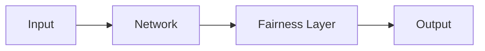

# fairness_training Documentation

This directory contains the source files for the fairness_training documentation, built with [MkDocs](https://www.mkdocs.org/) and the [Material theme](https://squidfunk.github.io/mkdocs-material/).

## Quick Start

### Install dependencies

```bash
pip install -r requirements-docs.txt
```

### Serve locally (with live reload)

```bash
mkdocs serve
```

Then open http://127.0.0.1:8000 in your browser.

### Build static site

```bash
mkdocs build
```

The built site will be in the `site/` directory.

## Deployment

### GitHub Pages

To deploy to GitHub Pages:

```bash
mkdocs gh-deploy
```

This builds the docs and pushes to the `gh-pages` branch.

### Other hosting

The `site/` directory can be deployed to any static hosting:
- Netlify
- Vercel
- AWS S3
- Any web server

## Documentation Structure

```
docs/
├── index.md                 # Home page
├── getting-started/         # Installation & quickstart
│   ├── installation.md
│   └── quickstart.md
├── user-guide/              # Conceptual guides
│   ├── concepts.md
│   ├── fairness-metrics.md
│   ├── training.md
│   ├── inference.md
│   └── custom-metrics.md
├── examples/                # Complete working examples
│   ├── large-batch.md
│   ├── small-batch.md
│   └── regression.md
├── api/                     # API reference
│   ├── fair-model.md
│   ├── fair-trainer.md
│   ├── fairness-metrics.md
│   └── utils.md
└── javascripts/
    └── mathjax.js           # LaTeX math rendering
```

## Writing Documentation

### Markdown Extensions

The following extensions are enabled:

- **Admonitions**: `!!! note "Title"` for callout boxes
- **Code highlighting**: Fenced code blocks with syntax highlighting
- **Math**: LaTeX via MathJax (`\(...\)` inline, `\[...\]` display)
- **Mermaid**: Diagrams via ```` ```mermaid ````
- **Tabs**: `=== "Tab 1"` for tabbed content
- **Tables**: Standard markdown tables

### Examples

**Admonition:**
```markdown
!!! warning "Important"
    This is a warning box.
```

**Math:**
```markdown
Inline: \(E[\hat{Y}|A=0]\)

Display:
\[
g(z) = \arg\min_{\tilde{y}} \|\tilde{y} - z\|_2^2
\]
```

**Mermaid diagram:**
````markdown

````

### API Documentation

API pages use `mkdocstrings` to auto-generate from docstrings:

```markdown
::: fairness_training.FairModel
    options:
      show_root_heading: true
```

## Configuration

Main configuration is in `mkdocs.yml`. Key settings:

- `site_name`: Documentation title
- `repo_url`: Link to GitHub repo
- `theme`: Material theme configuration
- `plugins`: mkdocstrings for API docs
- `nav`: Documentation structure

## Updating

When updating the package:

1. Update API reference if signatures change
2. Add new examples for new features
3. Update version number references
4. Test locally with `mkdocs serve`
5. Deploy with `mkdocs gh-deploy`

## License

Documentation is part of the fairness_training project and shares its license.
