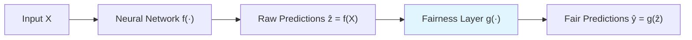

# fairness_training

**Guaranteed fairness constraints for PyTorch neural networks**

[](https://www.python.org/downloads/)
[](https://pytorch.org/)
[](https://opensource.org/licenses/MIT)
[](https://colab.research.google.com/github/dtroxell19/fairness_training/blob/main/notebooks/quickstart.ipynb)

---

## What is fairness_training?

`fairness_training` lets you train any PyTorch network with **hard fairness constraints**. Unlike penalty-based methods that only *encourage* fairness, this library *guarantees* that predictions satisfy specified criteria on every training batch.

The approach: append a **differentiable fairness layer** — a convex optimization problem solved via [cvxpylayers](https://locuslab.github.io/2019-10-28-cvxpylayers/) — that projects raw predictions onto the feasible set defined by your constraints. Because the projection is differentiable, gradients flow back through it into the network weights during training.

---

## Key Features

<div class="grid cards" markdown>

-   **Verified Fairness**

    ---

    Hard constraints guarantee that the specified constraints are satisfied

-   **End-to-End Learning and Constraint-Aware**

    ---

    The fairness layer is fully differentiable, enabling the model to learn how to satisfy constraints during training as opposed to relying on post-hoc corrections after model training

-   **Flexible Architecture**

    ---

    Works with any classification or regression architecture. Just append the fairness layer to the end of your model

-   **Online Inference**

    ---

    Novel primal-dual algorithm provides aggregate fairness guarantees over time even with small batch sizes during real-time inference

</div>

---

## How It Works



The fairness layer solves a convex optimization problem:

\[
g(z) = \arg\min_{\tilde{y}} \|\tilde{y} - z\|_2^2 \quad \text{s.t.} \quad \text{constraints satisfied}
\]

This projection is differentiable via implicit differentiation through the KKT conditions, enabling standard backpropagation.

---

## Supported Fairness Criteria

| Metric | Description | Use Case |
|--------|-------------|----------|
| **Mean Prediction Parity** | \(  \lvert E[\hat{y} \mid x_j=0] - E[\hat{y} \mid x_j=1]  \rvert \leq \epsilon \) | Regression or Classification Scores |
| **Mean Residual Fairness** | \( \lvert E[y - \hat{y} \mid x_j=a] \rvert \leq \epsilon \ \forall a \) | Regression or Classification Scores |
| **Equalized Odds** | \( \lvert E[\hat{y} \mid x_j=0, y=a] - E[\hat{y} \mid x_j=1, y = a] \rvert \leq \epsilon\ \forall a \in \{0,1\} \)| Binary Classification |
| **Custom Metrics** | Extend `FairnessMetric` base class | Affine fairness constraints |

---

## Citation

If you use fairness_training in your research, please cite:

```bibtex
@inproceedings{troxell2026fairness,
  title     = {Differentiable Optimization Layers for Guaranteed Fairness in Deep Learning},
  author    = {Troxell, David and Roemer, Noah and Mont{\'u}far, Guido},
  booktitle = {Proceedings of the 43rd International Conference on Machine Learning},
  year      = {2026},
  note      = {To appear}
}
```
This package relies heavily on the wonderful [cvxpylayers](https://locuslab.github.io/2019-10-28-cvxpylayers/) package. We encourage you to also cite their work:

```bibtex
@inproceedings{agrawal2019differentiable,
  title     = {Differentiable Convex Optimization Layers},
  author    = {Agrawal, Akshay and Amos, Brandon and Barratt, Shane and Boyd, Stephen and Diamond, Steven and Kolter, Zico},
  booktitle = {Advances in Neural Information Processing Systems},
  volume    = {32},
  year      = {2019}
}
```

---

## Next Steps

<div class="grid cards" markdown>

-   [:material-rocket-launch: **Getting Started**](getting-started/installation.md)

    ---

    Install the fairness_training package

-   [:material-book-open-variant: **User Guide**](user-guide/concepts.md)

    ---

    Learn the core concepts, assumptions, and how to use fairness_training effectively

-   [:material-code-tags: **API Reference**](api/fair-model.md)

    ---

    Complete documentation of all classes and functions

-   [:material-flask: **Examples**](examples/large-batch.md)

    ---

    End-to-end examples on real datasets

</div>
