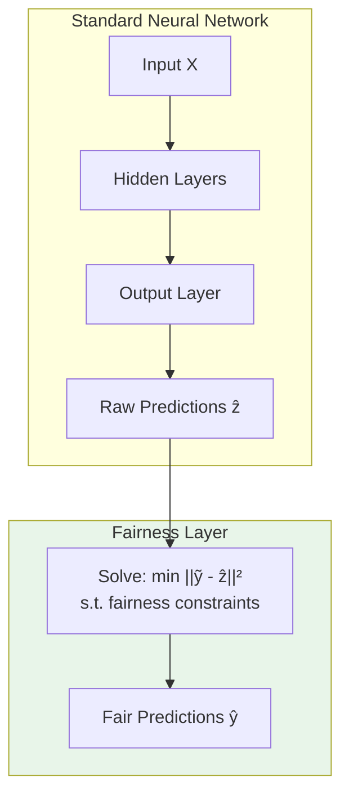

# Core Concepts

This page explains the key ideas behind the fairness_training package and when to use it.

---

## The Fairness Problem

Growing AI regulations require that models pass audits and meet certain criteria. Some examples of typical issues that arise:

- A loan approval model might sacrifice accuracy for one subgroup (example: rural businesses) in order to boost overall accuracy
- A hiring algorithm might favor candidates of one gender over another as it was trained on historical data

**Group fairness** constraints aim to ensure statistical parity of some metric across protected groups.

---

## The fairness_training Approach

### Traditional Methods and Their Limitations

| Method | How it Works | Limitation |
|--------|--------------|------------|
| **Pre-processing** | Modify training data | Can amplify bias; no guarantees |
| **In-processing (Penalties)** | Add fairness penalty to loss | Soft constraints; no guarantees |
| **Post-processing** | Adjust predictions after training | Model wasn't trained for fairness and may not generalize well |

### The Fairness Layer

fairness_training takes a different approach: append a **differentiable optimization layer** that projects predictions onto the feasible set defined by your constraints.



**Key insight**: The fairness layer is a convex optimization problem, which is:

1. **Differentiable** - Gradients can be computed via implicit differentiation through the KKT conditions
2. **Guaranteed feasible** - Output always satisfies the constraints
3. **Minimal distortion** - Finds the closest feasible point to the raw predictions

---

## Mathematical Formulation

### The Fairness Layer

Given raw predictions \(z = f_\theta(X)\) from a neural network, the fairness layer computes:

\[
g(z) = \arg\min_{\tilde{y}} \|\tilde{y} - z\|_2^2 \quad \text{subject to} \quad A\tilde{y} \leq b
\]

where \(A\tilde{y} \leq b\) encodes the fairness constraints.

---

## Affine Fairness Constraints

fairness_training supports fairness constraints that can be expressed as affine functions of the predictions. See the Fairness Metrics section for examples.

---

## Two Inference Regimes

In standard ML inference settings, a large batch of samples are received at once (e.g. a validation or test set). In such cases, constraints are enforced per mini-batch. When batch composition is constant across batches (i.e. the group ratio is the same in every batch — achieved via stratified sampling), enforcing per-batch constraints automatically implies aggregate fairness over the full dataset.

In other settings, only a small number of inputs arrive at a time. In these **online / streaming** settings, enforcing hard per-batch constraints may be infeasible or overly restrictive. To handle this, `fairness_training` uses a primal-dual algorithm that provides a weaker but still meaningful guarantee: the **sample-weighted average violation** converges to at most ε as the number of inference batches grows.

!!! note "What 'aggregate fairness' means in the small-batch regime"
    The primal-dual algorithm guarantees that as T → ∞:

    $$\bar{\Delta}_T = \frac{1}{N_T} \sum_{t=1}^{T} n_t \cdot \Delta_t \;\leq\; \varepsilon$$

    where $n_t$ is the number of samples in batch $t$, $\Delta_t$ is the per-batch fairness gap, and $N_T = \sum_t n_t$ is the total number of predictions made.

    This is **not** the same as the pooled gap $|\bar{E}[\hat{y}|A=0] - \bar{E}[\hat{y}|A=1]|$ computed over all predictions. The two coincide only when the group ratio $n_t^{(0)}/n_t^{(1)}$ is constant across batches. `weighted_avg_fairness_gap` in the evaluation output reports $\bar{\Delta}_T$; `pooled_fairness_gap` reports the raw pooled gap.

### Large-Batch Regime (batch_size ≥ b_tau)

When batches are large enough:

- Hard constraints are enforced per batch — every batch's predictions satisfy the fairness constraints
- Aggregate (pooled) fairness is automatically satisfied if batch composition is constant across batches

```python
# Large batches → hard constraints per batch
model = FairModel(..., b_tau=256)

predictions = model(X, inference=True)  # guaranteed: gap ≤ ε for this batch
```

### Small-Batch Regime (batch_size < b_tau)

For real-time inference where you can't control batch sizes:

- Individual batches **may violate** constraints
- The primal-dual algorithm guarantees that the **sample-weighted average violation converges to ≤ ε** as the number of batches grows

```python
model.reset_inference_state()  # always reset before a new inference sequence

for batch in streaming_data:
    predictions = model(batch, inference=True)  # per-batch gap may exceed ε

# After many batches, the sample-weighted average gap converges to ≤ ε
stats = model.get_aggregate_fairness_stats(streaming_loader, reset_before=True)
print(stats['weighted_avg_fairness_gap'])   # → ≤ ε asymptotically
# Note: stats['pooled_aggregate_gap'] may differ if group ratios vary across batches
```

---

## Marginal Fairness (Multiple Protected Attributes)

fairness_training supports up to 2 protected attributes with **marginal fairness**:

- Constraints are enforced **independently** for each protected attribute

```python
model = FairModel(
    ...,
    protected_attr_idx=[0, 1],  # Gender and race
)
# Enforces: |E[Ŷ|gender=0] - E[Ŷ|gender=1]| ≤ ε
#      AND: |E[Ŷ|race=0] - E[Ŷ|race=1]| ≤ ε
```

---

## When to Use fairness_training

<div class="grid" markdown>

**Good fit**

- You need **guaranteed** constraints, not just encouraged (due to regulations, etc.)
- Your fairness metric is affine (most common ones are)
- You're using neural networks
- You can use stratified sampling during training

**Consider alternatives** 

- You need individual fairness (not group fairness)
- You need tighter notions of fairness (i.e. not just holding in expectation, or need to hold for hard assignments in classification settings)
- Your fairness metric is non-convex
- You need intersectional fairness across many attributes

</div>

---

## Next Steps

- **[Fairness Metrics](fairness-metrics.md)**: Details on each supported metric
- **[Training Models](training.md)**: Best practices for training
- **[Inference](inference.md)**: Deploying in production
