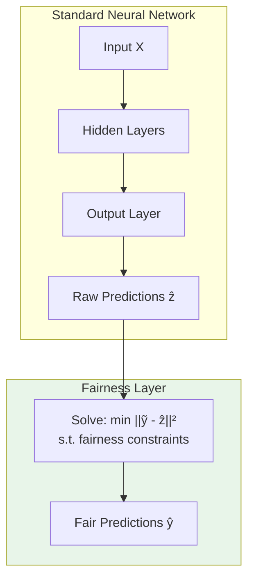

# Core Concepts

This page explains the key ideas behind the fairness_training package and when to use it.

---

## The Fairness Problem

Growing AI regulations require that models pass audits and meet certain criteria. Some examples of typical issues that arise:

- A loan approval model might sacrifice accuracy for one subgroup (example: rural businesses) in order to boost overall accuracy
- A hiring algorithm might favor candidates of one gender over another as it was trained on historical data

**Group fairness** constraints aim to ensure statistical parity of some metric across protected groups.

---

## The fairness_training Approach

### Traditional Methods and Their Limitations

| Method | How it Works | Limitation |
|--------|--------------|------------|
| **Pre-processing** | Modify training data | Can amplify bias; no guarantees |
| **In-processing (Penalties)** | Add fairness penalty to loss | Soft constraints; no guarantees |
| **Post-processing** | Adjust predictions after training | Model wasn't trained for fairness and may not generalize well |

### The Fairness Layer

fairness_training takes a different approach: append a **differentiable optimization layer** that projects predictions onto the feasible set defined by your constraints.



**Key insight**: The fairness layer is a convex optimization problem, which is:

1. **Differentiable** - Gradients can be computed via implicit differentiation through the KKT conditions
2. **Guaranteed feasible** - Output always satisfies the constraints
3. **Minimal distortion** - Finds the closest feasible point to the raw predictions

---

## Mathematical Formulation

### The Fairness Layer

Given raw predictions \(z = f_\theta(X)\) from a neural network, the fairness layer computes:

\[
g(z) = \arg\min_{\tilde{y}} \|\tilde{y} - z\|_2^2 \quad \text{subject to} \quad A\tilde{y} \leq b
\]

where \(A\tilde{y} \leq b\) encodes the fairness constraints.

---

## Affine Fairness Constraints

fairness_training supports fairness constraints that can be expressed as affine functions of the predictions. See the Fairness Metrics section for examples.

---

## Two Inference Regimes

In standard ML inference settings, a large batch of samples are received at once and new predictions are made (validation or test set.). In
such cases, we enforce constraints per-mini batch in the validation/test set. If the makeup of each batch is the same (i.e. the ratio of observations belonging to each group is the same) then the fairness constraints are automatically satisfied when considering the entire validation/set at once.

However, in other settings, only a small number of new inputs may be received at a time. In these "online" or "streaming" prediction settings, enforcing the constraints at the mini-batch level may severely limit the predictive power and expressivity of the network. To overcome this, we introduce a primal-dual algorithm that guarantees aggregate fairness (i.e. fairness when considering ALL inference predictions ever made) over time. Note that while fairness is guaranteed over time, in this setting, there is no guarantee aggregate fairness will be achieved after a given finite inference dataset.

### Large-Batch Regime (batch_size ≥ b_tau)

When batches are large enough:

- Hard constraints are enforced per batch
- Each batch's predictions satisfy fairness constraints
- Aggregate fairness is automatically satisfied if batch composition is constant

```python
# Large batches: hard constraints
model = FairModel(..., b_tau=500) # 500 is chosen by the modeler. In reality, this can be any number if stratified sampling is used to keep batch composition constant

# With batch_size=500, each batch satisfies constraints
predictions = model(X, inference=True)
```

### Small-Batch Regime (batch_size < b_tau)

For real-time inference with small batches:

- Individual batches may violate constraints
- **Aggregate fairness is guaranteed** over time via online primal-dual algorithm

```python
# Small batches: primal-dual algorithm
model.reset_inference_state()

for batch in streaming_data:
    predictions = model(batch, inference=True)  # May violate per-batch
    
# Aggregate is guaranteed fair
stats = model.get_aggregate_fairness_stats()
assert stats['aggregate_gap'] <= model.fairness_tolerance
```

---

## Marginal Fairness (Multiple Protected Attributes)

fairness_training supports up to 2 protected attributes with **marginal fairness**:

- Constraints are enforced **independently** for each protected attribute

```python
model = FairModel(
    ...,
    protected_attr_idx=[0, 1],  # Gender and race
)
# Enforces: |E[Ŷ|gender=0] - E[Ŷ|gender=1]| ≤ ε
#      AND: |E[Ŷ|race=0] - E[Ŷ|race=1]| ≤ ε
```

---

## When to Use fairness_training

<div class="grid" markdown>

**Good fit**

- You need **guaranteed** constraints, not just encouraged (due to regulations, etc.)
- Your fairness metric is affine (most common ones are)
- You're using neural networks
- You can use stratified sampling during training

**Consider alternatives** 

- You need individual fairness (not group fairness)
- You need tighter notions of fairness (i.e. not just holding in expectation, or need to hold for hard assignments in classification settings)
- Your fairness metric is non-convex
- You need intersectional fairness across many attributes

</div>

---

## Next Steps

- **[Fairness Metrics](fairness-metrics.md)**: Details on each supported metric
- **[Training Models](training.md)**: Best practices for training
- **[Inference](inference.md)**: Deploying in production
